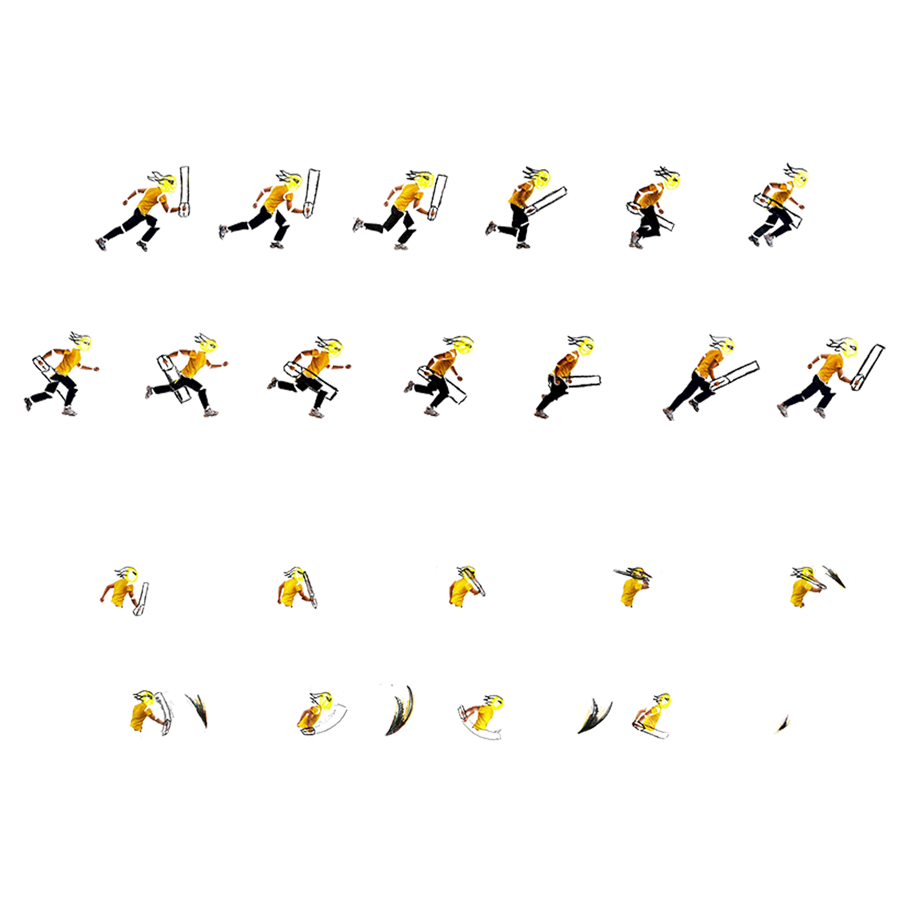

# 🎮 **Super Paper Runner Jumper Man** 

> **Short Pitch**: A brief and catchy description of your game. Highlight the concept, genre, and key features.
> 
> *Example:* "Run and jump over monsters and obstacles in this papery Autorunner-sidescroller game!"

---

##
I am trying to host the game but I have no clue what the issue is with it becasue it somehow has big problems with loading the pictures and just spits out 404 errors :(

---

## 📸 **Screenshots**

### Main Gameplay:

  
  
*Figure 1: start screen of the game.*

---

### Menu and UI:

  
  
*Figure 2: screenshot of gameplay.*

---

## 🎨 **Spritesheets**
Below are the sprites used to create characters and objects in the game:

### Player Character:

  
  
*Figure 3: Mind that the cracaters legs and upperbody are a seperate spriesheet for smoother animations

---

### Enemies and NPCs:

  
  
*Figure 4: all the enemies are handrawn on paper and scanned.*

---

## ✍️ **Reflection**

### What went well:
- **Creative Design:** The idea for the artstyle of the game came to me when using the paper background as a placeholder, but the it just clicked that i could make a paper themed game.
- **Core Mechanics:** they are simple but work, I am happy with that I managed to implement.

### Challenges:
- **Time Constraints:** The coding in general, but it got better by the day 
- **Bug Fixes:** A few bugs were just annyoing to find as the game didnt pron.

### Lessons Learned:
- **Prototyping Matters:** How to handle console.log for bugfixing and imporving my knowledge of how code.
- **Keep it Simple:** doing it step by step and not overcomplicating my code structure.
